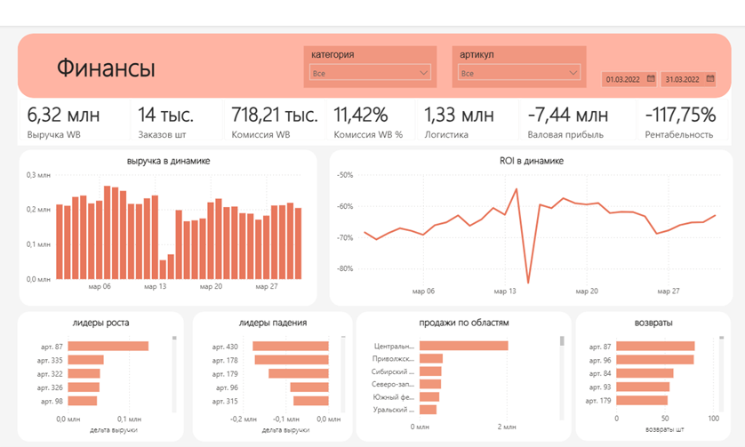

# WB Financial Dashboard — Power BI

Финансовый дашборд для продавца на Wildberries (ИП Кулемина).  
Тестовое задание на позицию аналитика данных.



---

## Задача

Построить автоматизированный отчёт в Power BI для оценки рентабельности продаж на Wildberries.  
Источники данных: PostgreSQL (WB API) + Google Sheets.

**Боли клиента:**
- Не понимают реальные затраты на продажу (логистика, комиссии, налоги)
- Сложно отследить какой товар растёт или падает
- Неясно какие регионы приоритетны

---

## Стек

| Инструмент | Применение |
|---|---|
| **Power BI Desktop** | Визуализация, DAX-меры, модель данных |
| **Power Query (M)** | Подключение к источникам, очистка данных |
| **PostgreSQL** | База данных с выгрузкой WB API |
| **Google Sheets** | Себестоимость, справочник номенклатуры, тарифы |
| **Python** | Независимая верификация расчётов |

---

## Источники данных

### PostgreSQL (WB API)
- `SalesReport` — отчёт реализации (610K строк): выручка, комиссии, логистика
- `Sales` — журнал продаж (270K строк): цены, регионы покупателей
- `v_orders` — заказы (281K строк)

### Google Sheets
- Таблица себестоимости по баркодам
- Справочник номенклатуры (артикулы, категории, бренды)
- Тарифы и доставка по категориям

---

## Модель данных

Схема «созвездие» (Galaxy Schema):

```
         DimCost          DimDate
            |                |
   DimTariff — DimProduct    |
                 \           |
     FactOrders — FactSalesReport — FactSales
```

**7 таблиц, 8 связей**, из них 1 двунаправленная (DimCost ↔ DimProduct) для работы формулы `RELATED(DimCost[cost])` через цепочку FactSalesReport → DimProduct → DimCost.

Режим подключения: **Импорт**.

---

## Метрики (DAX)

| # | Метрика | Тип |
|---|---|---|
| 1 | Выручка WB | Карточка |
| 2 | Заказов шт | Карточка |
| 3 | Комиссия WB | Карточка |
| 4 | Комиссия WB % | Карточка |
| 5 | Логистика | Карточка |
| 6 | Валовая прибыль | Карточка |
| 7 | Рентабельность | Карточка |
| 8 | ROI в динамике | График |
| 9 | Выручка в динамике | График |
| 10 | Лидеры роста / падения | Топ по дельте выручки |
| 11 | Продажи по областям | Диаграмма |
| 12 | Лидеры возвратов | Топ |

**Фильтры:** дата (пользовательский период), категория, артикул.

---

## Ключевые решения

### Очистка данных
- Поле `dag_date` в SalesReport покрывало только май–сентябрь 2022. Переключилась на `sale_dt` (дата фактической продажи) — данные расширились до января 2022
- Баркоды переведены из числа в текст (защита от потери цифр при округлении)
- Удалены строки с пустыми ключевыми полями

### Верификация
Все 11 метрик проверены независимо через Python (psycopg2 + SQL-запросы).  
Расхождение с Power BI: **менее 1 рубля** (разница в округлении).

### Бизнес-инсайт
Дашборд выявил убыточность бизнеса: средняя себестоимость **415₽** при средней цене продажи **214₽**.  
Рентабельность: **−125%**. ROI: **−66%** в течение всего периода.

---

## Структура репозитория

```
├── images/
│   └── dashboard.png       # Скриншот готового дашборда
├── scripts/
│   ├── verify_metrics.py   # Верификация всех метрик через Python
│   └── verify_final.py     # Финальная проверка по периодам
└── README.md
```

---

## Период данных

**2 января 2022 — 10 сентября 2022**

*Данные анонимизированы.*
